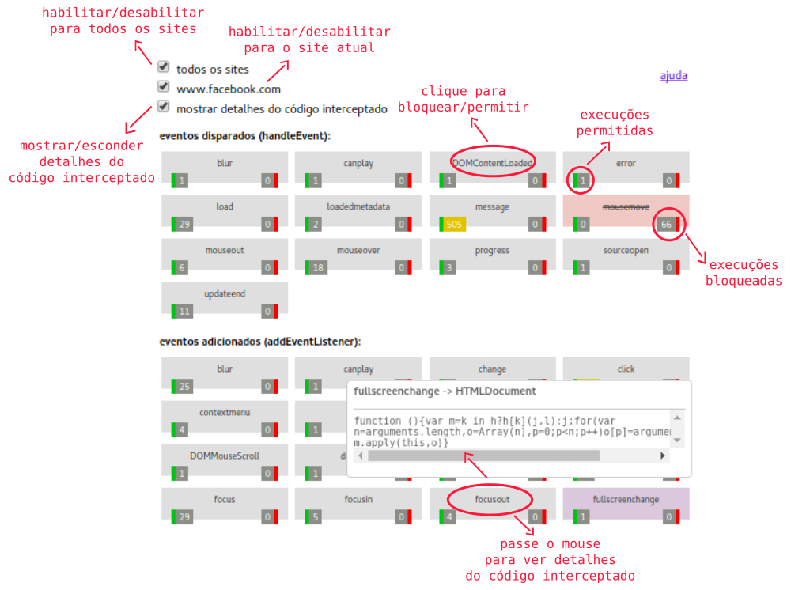
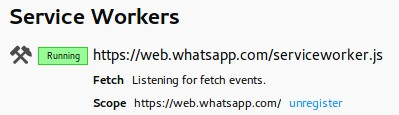

# Luminous: Bloqueador de eventos JavaScript 

> [en-US](doc/en-US) | pt-BR

Uma extensão experimental para identificar, analisar e bloquear a execução de códigos e a coleta de eventos via *JavaScript* em seu navegador.

- [Por quê?](#por-qu%C3%AA)
- [Entendendo a interface do usuário](#entendendo-a-interface-do-usu%C3%A1rio)
- [Como instalar](#como-instalar)
- [Experimente!](#experimente)
- [Se aprofunde no tema](#se-aprofunde-no-tema)
- [Como colaborar](#como-colaborar)
- [Problemas conhecidos](#problemas-conhecidos)
- [Entendendo o código](#entendendo-o-c%C3%B3digo)
- [Licença](#licen%C3%A7a)
- [Doações](#doa%C3%A7%C3%B5es)

## Por quê?

Existem projetos incríveis como o [*Lightbeam*](https://www.mozilla.org/pt-BR/lightbeam/), [*NoScript*](https://noscript.net/), [*ScriptSafe*](https://github.com/andryou/scriptsafe), [*uBlock Origin*](https://github.com/gorhill/uBlock), [*HTTPS Everywhere*](https://github.com/EFForg/https-everywhere) e diversos outros. Todos possuem a proposta de identificar e/ou impedir a execução de códigos e requisições questionáveis.

Tais ferramentas são vitais, mas inevitavelmente precisamos fazer concessões para conseguir acessar muitos sites já que a utilização de *JavaScript* é massiva na web. Ao acessar por exemplo o [*Google Tradutor*](https://translate.google.com), utilizando um combo de 3 extensões (*HTTPS Everywhere*, *uBlock Origin* e *ScriptSafe*) com a *Luminous* temos o seguinte resultado após um breve momento de utilização do website:

> 

- **6** requisições influenciadas pela *HTTPS Everywhere*
- **75** requisições bloqueadas pela *uBlock Origin*
- **4** itens bloqueados pela *ScriptSafe*
- **7,6 mil** execuções de *JavaScript* detectadas pela *Luminous*

É sobre este número (**7,6 mil**) que estamos perdidos e de mãos atadas, é alí que não sabemos o que acontece e ainda não temos a liberdade de decidir o que pode e o que não pode ser executado. Este é o principal objetivo do projeto, preencher esta lacuna e conseguir ver e controlar o que acontece. Como efeito colateral acabamos tendo também uma ferramenta interessante que ajuda no desenvolvimento de códigos em *JavaScript* ao nos dar visibilidade sobre o que está acontecendo.

## Entendendo a interface do usuário



## Como instalar

- Chromium e Google Chorme: [Chrome Web Store](https://chrome.google.com/webstore/detail/luminous-javascript-event/baacpbikplogpeecclpnajnlghmcldkb)
- Mozilla Firefox: [Fifrefox Add-ons](https://addons.mozilla.org/en-US/firefox/addon/luminous/)
- Opera: *aguardando revisão (Opera add-ons)*

## Experimente!

[Instale](#como-instalar) a extensão e acesse a nossa [página de demonstração](https://gbaptista.github.io/luminous/html/demo-page.html) para experimentar e entender melhor o seu funcionamento:


## Se aprofunde no tema

Este experimento faz parte de um livro que está sendo escrito de *WebExtensions API* sob a ótica de temas como liberdade e privacidade nos meios digitais. Se deseja saber novidades sobre a publicação do mesmo, deixe aqui o seu email: [https://gbaptistas.typeform.com/to/jCzkkm](
https://gbaptistas.typeform.com/to/jCzkkm)

Enquanto o livro não é publicado, sugiro as seguintes referências para expandir a sua visão sobre o tema:

- Documentário: [*Do Not Track*](https://donottrack-doc.com)
- Livro: [*1984*](https://www.amazon.com.br/1984-George-Orwell-ebook/dp/B009XE662U)
- Livro: [*Cypherpunks. Liberdade e o Futuro da Internet*](https://www.amazon.com.br/Cypherpunks-Liberdade-internet-Julian-Assange-ebook/dp/B018SLCLPO)
- Livro: [*O filtro invisível: O que a internet está escondendo de você*](https://www.amazon.com.br/filtro-invisível-internet-está-escondendo-ebook/dp/B008OHONOU)
- Página na web: [*A Armadilha do JavaScript*](https://www.gnu.org/philosophy/javascript-trap.pt-br.html)
- Página na web: [*Saúde da Internet*](https://www.mozilla.org/pt-BR/internet-health/)  
- Página na web: [*Sobre o Lightbeam*](https://www.mozilla.org/pt-BR/lightbeam/about)

## Como colaborar

  - [Espalhe a ideia](#espalhe-a-ideia)
    - [Compartilhe](#compartilhe)
    - [Escreva e fale sobre](#escreva-e-fale-sobre)
    - [Ajude na tradução para outros idiomas](#ajude-na-tradu%C3%A7%C3%A3o-para-outros-idiomas)
  - [Reporte problemas](#reporte-problemas)
    - [Problemas em sites específicos](#problemas-em-sites-espec%C3%ADficos)
    - [Problemas em algum navegador](#problemas-em-algum-navegador)
  - [Bote a mão na massa](#bote-a-m%C3%A3o-na-massa)
    - [Ajude a melhorar a interface do usuário](#ajude-a-melhorar-a-interface-do-usu%C3%A1rio)
    - [Melhore o desempenho](#melhore-o-desempenho)
    - [Crie novas funcionalidades](#crie-novas-funcionalidades)
    - [Melhore a qualidade do código](#melhore-a-qualidade-do-c%C3%B3digo)

### Espalhe a ideia

#### Compartilhe

Conte aos seus amigos, familiares e colegas de trabalho sobre como a extensão foi utilizada para melhorar a sua experiência na web e os ensine a utilizá-la também!

#### Escreva e fale sobre

Descobriu que algum site estava invadindo a sua privacidade? Conseguiu bloquear eventos que não desejava? Conseguiu facilitar o desenvolvimento do seu código ou a depuração de erros? Grave um video, prepare uma palestra, escreva um artigo ou qualquer coisa do gênero contando como foi feito, explicando como a extensão o ajudou e mostrando as possibilidades.

#### Ajude na tradução para outros idiomas

Traduza os arquivos `.md` encontrados dentro do diretório `doc/` e os arquivos `.json` dentro do diretório `_locales/` para o seu idioma e nos ajude a atingir mais pessoas!

### Reporte problemas

#### Problemas em sites específicos

Teve problemas ao acessar algum site por causa da extensão? Ficou lento? Causou erros? O site parou de funcionar? Nem todos os eventos foram identificados? Abra uma [*issue*](https://github.com/gbaptista/luminous/issues) e conte pra gente sobre o que aconteceu.

#### Problemas em algum navegador

Abra uma [*issue*](https://github.com/gbaptista/luminous/issues) se algo não funcionou como você esperava em algum navegador. Queremos que tudo funcione bem em todos os navegadores possíveis!

### Bote a mão na massa

#### Ajude a melhorar a interface do usuário

Não temos a interface mais bonita e amigável possível. [Discussões](https://github.com/gbaptista/luminous/issues) e [propostas](https://github.com/gbaptista/luminous/pulls) sobre uma nova interface ou melhorias na já existente (*`html/interface-sample.html`*) serão muito bem-vindas! Não subestime o poder desse tipo de colaboração: [better_errors#6](https://github.com/charliesome/better_errors/issues/6) - [better_errors#22](https://github.com/charliesome/better_errors/pull/22)

#### Melhore o desempenho

**Exemplo 1**: Quanto mais cedo conseguirmos injetar o código nos websites e quanto menos recursos utilizarmos para processar as informações, mais execuções seremos capazes de identificar e melhor será a nossa experiência ao ter uma extensão que não deixe a navegação lenta.

Olhe por exemplo para a nossa página de demonstração (*`html/demo-page.html`*):

```javascript
(function() { setTimeout(function() {
  // JavaScript code...
}, 100); })();
```

Esse delay de 100 milessegundos existe pois sem ele o código é executado rápido demais e não conseguimos interceptá-lo. Como podemos melhorar isso para não precisarmos desse delay ou então conseguir diminuí-lo?


**Exemplo 2**: Capturamos apenas um pedaço da função interceptada, pois ela pode ser muito grande e deixar a leitura das informações lenta (*`js/content/interceptor.js`*):

```javascript
listener: ('' + listener).slice(0, 400)
```

Como podemos melhorar isso? Essa é a melhor maneira de lidar com este problema?

**Exemplo 3**: A maneira que encontramos de passar mensagens do contexto do documento para o contexto da extensão foi realizando o *parser* dos dados em *JSON* lendo um elemento *HTML* (*`js/content/readers/data.js`*):

```javascript
render_data(
  JSON.parse($(data_element).html()),
  tab_id
);
```
Existem alternativas? Fazer o *parse* das informações constantemente é a melhor opção?

#### Crie novas funcionalidades

Começamos com uma ideia básica: identificar e bloquear eventos. Podemos expandir essa ideia, alguns pensamentos que já surgiram:

- Interceptamos apenas chamadas para o `addEventListener` e o `handleEvent`. Não seria interessante interceptarmos também chamadas para o `XMLHttpRequest` e outros?


- Não estamos interceptando eventos definidos *inline* (`<a onclick="someAction()">`), não seria interessante fazer isso?


- Hoje podemos bloquear os eventos por domínio: *"Bloquear a execução de `mouseover` no domínio `somesite.com`"*. Não seria interessante ter regras mais elaboradas e bloquear um evento apenas se o seu alvo for um tipo de elemento X ou o código executado for de acordo com alguma expressão regular?

#### Melhore a qualidade do código

Este é um projeto experimental que cresceu de forma descontrolada, não temos um padrão definido de nomenclatura, uma forte organização baseada em algum *design pattern* ou testes automatizados. Discussões para melhorar a qualidade do código nesse sentido serão muito bem-vindas!

## Problemas conhecidos

 - [Sem soluções alternativas](#sem-solu%C3%A7%C3%B5es-alternativas)
 - [Com soluções alternativas](#com-solu%C3%A7%C3%B5es-alternativas)
   - [Service Workers no Mozilla Firefox](#service-workers-no-mozilla-firefox)

### Sem soluções alternativas
 - Não interceptamos codigos *inline* (`<a onclick="someAction()">`).


 - Um código pode ser executado antes de conseguirmos injetar o interceptador. É raro, mas possível.


 - Alguns sites com uma quantidade absurda de eventos *JavaScript* pode deixar o navegador lento por conta da coleta de dados sobre as interceptações realizadas.

### Com soluções alternativas

#### Service Workers no Mozilla Firefox

No *Mozilla Firefox* e derivados, alguns sites que utlizam [*Service Workers*](https://developer.mozilla.org/en-US/docs/Web/API/Service_Worker_API) (como o [*WhatsApp Web*](https://web.whatsapp.com/)) podem bloquear o código de interceptação por conta de um *bug* na interceptação dos *headers* com as diretrizes de [*Content-Security-Policy*](https://developer.mozilla.org/en-US/docs/Web/HTTP/Headers/Content-Security-Policy). A solução alternativa atual consiste em recarregar o *Service Worker*:

 - Acesse a tela de *Service Workers* em: `about:debugging#workers`
 - Clique em *unregister* no *Service Worker* do site desejado:

  
 - Recarregue o site.

## Entendendo o código

- [Background](#background)
- [Content](#content)
- [Pop-up](#pop-up)
- [Utilidades](#utilidades)
- [Bibliotecas de terceiros](#bibliotecas-de-terceiros)

### Background

`js/background`:

- `js/background/set_current_tab.js`: Responsável por injetar o *ID* da *tab* atual no documento.

- `js/background/set_response_headers.js`: Responsável por alterar o *header* de *Content-Security-Policy* das requisições.

- `js/background/update_badge.js`: Responsável por atualizar o contador mostrado no ícone da extensão.

### Content

`/content/injections`:

 - `/content/injections/data.js`: Responsável por injetar o elemento *HTML* que armazenará os dados coletados das interceptações.

 - `/content/injections/interceptor.js`: Responsável por injetar o código que executará as interceptações de fato no documento.

- `/content/injections/options.js`: Responsável por injetar o elemento *HTML* que armazenará os opções definidas pelo usuário.

`/content/readers`:

- `/content/readers/data.js`: Responsável por ler os dados no elemento *HTML* do documento que armazena os detalhes coletados das interceptações e repassa-los à extensão.

`/content/interceptor.js`: Responsável por interceptar execuções de códigos *JavaScript* no contexto do documento e coletar detalhes sobre elas.

### Pop-up

Responsáveis por renderizar e cuidar das interações feitas no pop-up que é aberto ao clicar no ícone da extensão:

- `html/popup/popup.html`
- `html/popup/templates/counters.html`
- `html/popup/templates/options.html`
- `js/popup/popup.js`
- `css/popup/popup.css`

### Utilidades

- `js/utils/colors.js`: Função utilizada para determinar a cor exibida com base no valor do contador.
- `js/utils/number.js`: Função utilizada para formatar o número de acordo com seu tamanho.

### Bibliotecas de terceiros

- `js/vendor/jquery`: [*jQuery JavaScript Library*](https://github.com/jquery/jquery)
- `js/vendor/mustachejs`: [*Minimal templating with {{mustaches}} in JavaScript*](https://github.com/janl/mustache.js)
- `js/vendor/tippyjs`: [*A lightweight, vanilla JS tooltip library*](https://github.com/atomiks/tippyjs)

## Licença

Este projeto está licenciado sob a [*GPLv3*](LICENSE).

## Doações

Não há nenhum tipo de organização para o recebimento de doações no momento. Veja nosso guia sobre *"[como colaborar](#como-colaborar)"* para outras maneiras de contribuição e também sobre o livro que está sendo escrito em *"[se aprofunde no tema](#se-aprofunde-no-tema)"*. Se deseja realmente realizar uma doação, eis algumas fundações incríveis que vão de encontro com os temas abordados neste projeto que você pode ajudar:

- [*Electronic Frontier Foundation*](https://supporters.eff.org/donate)
- [*Free Software Foundation*](https://www.fsf.org/about/ways-to-donate)
- [*Mozilla Foundation*](https://donate.mozilla.org)
- [*Tor Project*](https://donate.torproject.org)
