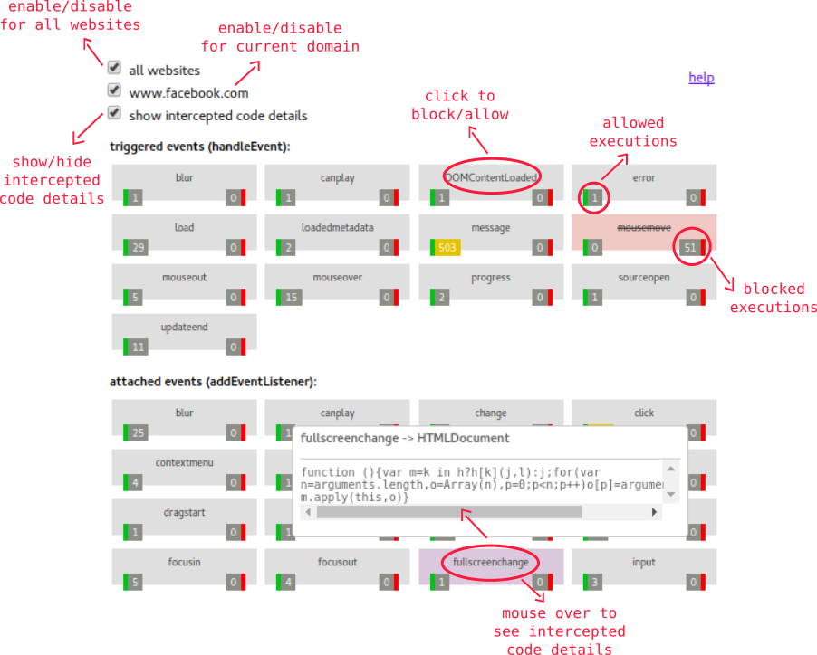
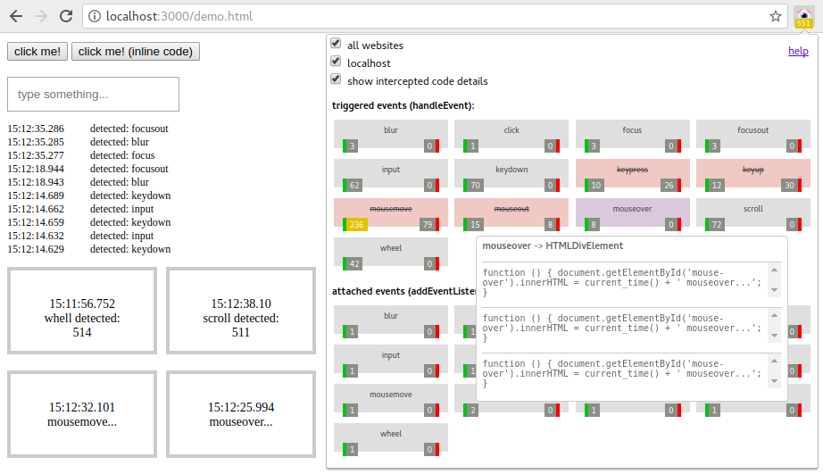

# Luminous: JavaScript events blocker 

> en-US | [pt-BR](https://gbaptista.github.io/luminous)

An experimental extension to identify, analyze and block code execution and event collection through *JavaScript* in your browser.

> *Warning: This document has been automatically translated. Please send us a [pull request](https://github.com/gbaptista/luminous/pulls) if you find any errors.*

- [Why?](#why)
- [Understanding the UI](#understanding-the-ui)
- [How to install](#how-to-install)
- [Try it!](#try-it)
- [Going deeper](#going-deeper)
- [How to contribute](#how-to-contribute)
- [Known issues](#known-issues)
- [Understanding the code](#understanding-the-code)
- [License](#license)
- [Donations](#donations)

## Why?

We have amazing projects like [*Lightbeam*](https://www.mozilla.org/en-US/lightbeam/), [*NoScript*](https://noscript.net/), [*ScriptSafe*](https://github.com/andryou/scriptsafe), [*uBlock Origin*](https://github.com/gorhill/uBlock), [*HTTPS Everywhere*](https://github.com/EFForg/https-everywhere) and many others. All have the proposal to identify and/ or prevent the execution of questionable codes and requests.


These tools are vital, but we inevitably need to make concessions to access many websites as we have a massive use of *JavaScript* on the web. When you access for example the [*Google Translate*](https://translate.google.com) website, with a combo of 3 extensions (*HTTPS Everywhere*, *uBlock Origin* and *ScriptSafe*) and *Luminous*, we have the following result after a few moments:

> 

- **6** requests influenced by *HTTPS Everywhere*
- **75** requests blocked by *uBlock Origin*
- **4** items blocked by *ScriptSafe*
- **7,6 thousand** *JavaScript* executions detected by *Luminous*

It's about this number (**7,6 thousand**) that we are lost and with hands tied, it's there that we do not know what happens and we still do not have the freedom to decide what can or can't be executed. This is the main purpose of the project, filling this gap and being able to see and control what happens. As a side effect we end up also having an interesting tool that helps in *JavaScript* code developing process by giving us visibility about what is happening.

## Understanding the UI



## How to install

- Chromium e Google Chorme: [Chrome Web Store](https://chrome.google.com/webstore/detail/luminous-javascript-event/baacpbikplogpeecclpnajnlghmcldkb)
- Mozilla Firefox: [Fifrefox Add-ons](https://addons.mozilla.org/en-US/firefox/addon/luminous/)
- Opera: *pending review (Opera add-ons)*

## Try it!

[Install](#how-to-install) the extension and go to our [demo page](https://gbaptista.github.io/luminous/html/demo-page.html) to experience and better understand how it works:



## Going deeper

This experiment is part of a book being written about *WebExtensions API* from the perspective of themes like freedom and privacy in the digital world. If you want to receive news about the publication, please leave your email: [https://gbaptistas.typeform.com/to/VRklaw](https://gbaptistas.typeform.com/to/VRklaw)

While the book is not published, I suggest the following references to expand your view on the topic:

- Documentary: [*Do Not Track*](https://donottrack-doc.com)
- Book: [*1984*](https://www.amazon.com/1984-George-Orwell-ebook/dp/B003JTHWKU)
- Book: [*Cypherpunks: Freedom and the Future of the Internet*](https://www.amazon.com/Cypherpunks-Freedom-Internet-Julian-Assange-ebook/dp/B00AZBI4IO)
- Book: [*The Filter Bubble: How the New Personalized Web Is Changing What We Read and How We Think*](https://www.amazon.com/Filter-Bubble-Personalized-Changing-Think-ebook/dp/B004IYJE6A)
- Web page: [*The JavaScript Trap*](https://www.gnu.org/philosophy/javascript-trap.en.html)
- Web page: [*Internet Health*](https://www.mozilla.org/en-US/internet-health/)
- Web page: [*About Lightbeam*](https://www.mozilla.org/en-US/lightbeam/about)

## How to contribute

  - [Spread the word](#spread-the-word)
    - [Share](#share)
    - [Write and talk about it](#write-and-talk-about-it)
    - [Help with translations](#help-with-translations)
  - [Report issues](#report-issues)
    - [Issues on specific websites](#issues-on-specific-websites)
    - [Issues in some browser](#issues-in-some-browser)
  - [Get your hands dirty](#get-your-hands-dirty)
    - [Improve the UI](#improve-the-ui)
    - [Improve performance](#improve-performance)
    - [Create new features](#create-new-features)
    - [Improve code quality](#improve-code-quality)

### Spread the word

#### Share

Tell your friends, family, and co-workers about how the extension was used to improve your web experience and teach them how to use it too!

#### Write and talk about it

Did you find a website invading your privacy? Did you block events you did'nt want? Did you make it easier for you to develop your code or debug errors? Record a video, prepare a talk, write an article or anything like that telling how it was done, explaining how the extension helped you and showing the possibilities.

#### Help with translations

Translate the `.md` files found inside the `doc/` directory and the `.json` files into the `_locales/` directory for your language and help us reach more people!

### Report issues

#### Issues on specific websites

Had trouble accessing a site because of the extension? Was it slow? Caused errors? Has the site stopped working? Not all events were identified? Open an [*issue*](https://github.com/gbaptista/luminous/issues) and tell us what happened.

#### Issues in some browser

Open an [*issue*](https://github.com/gbaptista/luminous/issues) if something didn't work as expected in a browser. We want everything to work fine for all possible browsers!

### Get your hands dirty

#### Improve the UI

We don't have the most beautiful and friendly interface in the world. [Discussions](https://github.com/gbaptista/luminous/issues) and [proposals](https://github.com/gbaptista/luminous/pulls) on a new interface or improvements to the existing one (*`html/interface-sample.html`*) will be very welcome! Do not underestimate the power of this kind of collaboration: [better_errors#6](https://github.com/charliesome/better_errors/issues/6) - [better_errors#22](https://github.com/charliesome/better_errors/pull/22)

#### Improve performance

**Example 1**: The sooner we can inject code into websites and the less resources we use to process information, the more executions we'll be able to identify and the better our experience will be by having an extension that does not slow navigation.

Look for example to our demo page (*`html/demo-page.html`*):

```javascript
(function() { setTimeout(function() {
  // JavaScript code...
}, 100); })();
```

This delay of 100 milliseconds exists because without it the code is executed too fast and we can not intercept it. How can we improve this so we do not need this delay or can we reduce it?

**Example 2**: We capture only one piece of the intercepted function, because it can be very large and let the reading of the information slow (*`js/content/interceptor.js`*):

```javascript
listener: ('' + listener).slice(0, 400)
```

How can we improve this? Is this the best way to deal with this problem?

**Example 3**: The way we found to pass messages from the context of the document to the context of the extension was by parsing the data in *JSON* reading an *HTML* element (*`js/content/readers/data.js`*):

```javascript
render_data(
  JSON.parse($(data_element).html()),
  tab_id
);
```

Are there alternatives? Is parsing information constantly the best option?

#### Create new features

We start with a basic idea: identify and block events. We can expand this idea, some thoughts that have already arisen:

- We intercept only calls to `addEventListener` and `handleEvent`. Would not it be interesting to also intercept calls to `XMLHttpRequest` and others?


- We are not intercepting *inline* defined events (`<a onclick="someAction()">`), would not it be interesting to do so?


- Today we can block events by domain: *"Block the execution of mouseover in the domain somesite.com"*. Would not it be interesting to have more elaborate rules and block an event only if its target is an element of type X or the code executed is matches with some regular expression?

#### Improve code quality

This is an experimental project that grew in an uncontrolled way, we do not have a defined standard of nomenclature, a strong organization based on some *design pattern* or automated tests. Discussions to improve the quality of the code will be very welcome!

## Known Issues

- [Without workarounds](#without-workarounds)
- [With workarounds](#with-workarounds)
  - [Mozilla Firefox Service Workers](#mozilla-firefox-service-workers)

### Without workarounds

 - We did not intercept *inline* codes (`<a onclick="someAction()">`).


 - A code can be executed before we can inject the interceptor. It's rare, but possible.


 - Some websites with an absurd amount of *JavaScript* events may slow down the browsing experience because of the data collection on the intercepted codes.

### With workarounds

#### Mozilla Firefox Service Workers

In *Mozilla Firefox* and derivatives, some websites that use [*Service Workers*](https://developer.mozilla.org/en-US/docs/Web/API/Service_Worker_API) (like [*WhatsApp Web*](https://web.whatsapp.com/)) can block the code interception because of a bug in the interception of headers with the [*Content-Security-Policy*](https://developer.mozilla.org/en-US/docs/Web/HTTP/Headers/Content-Security-Policy) guidelines. The current workaround is to reload the *Service Worker*:

 - Access the *Service Workers* screen at: `about:debugging#workers`
 - Click on *unregister* in the *Service Worker* of the desired website:
  
 - Reload the website.

## Understanding the code

- [Background](#background)
- [Content](#content)
- [Pop-up](#pop-up)
- [Utils](#utils)
- [Third party libraries](#third-party-libraries)

### Background

`js/background`:

- `js/background/set_current_tab.js`: Responsible for injecting the current *tab* *ID* into the document.

- `js/background/set_response_headers.js`: Responsible for changing *Content-Security-Policy* *header* of requests.

- `js/background/update_badge.js`: Responsible for updating the counter on the extension icon.

### Content

`/content/injections`:

 - `/content/injections/data.js`: Responsible for injecting the *HTML* element that will store the data collected from the interceptions.

 - `/content/injections/interceptor.js`: Responsible for injecting the code that will actually execute the interceptions in the document.

- `/content/injections/options.js`: Responsible for injecting the *HTML* element that will store user-defined options.


`/content/readers`:

- `/content/readers/data.js`: Responsible for reading the data in the *HTML* element of the document that stores the collected details of the interceptions and passes them to the extension.

`/content/interceptor.js`: Responsible for intercepting executions of *JavaScript* codes in the context of the document and collecting details about them.

### Pop-up

Responsible for rendering and taking care of the interactions made in the pop-up that is opened by clicking the extension icon:

- `html/popup/popup.html`
- `html/popup/templates/counters.html`
- `html/popup/templates/options.html`
- `js/popup/popup.js`
- `css/popup/popup.css`

### Utils

- `js/utils/colors.js`: Function used to determine the color displayed based on the value of the counter.
- `js/utils/number.js`: Function used to format the number according to its size.

### Third party libraries

- `js/vendor/jquery`: [*jQuery JavaScript Library*](https://github.com/jquery/jquery)
- `js/vendor/mustachejs`: [*Minimal templating with {{mustaches}} in JavaScript*](https://github.com/janl/mustache.js)
- `js/vendor/tippyjs`: [*A lightweight, vanilla JS tooltip library*](https://github.com/atomiks/tippyjs)

## License

This project is licensed under the [*GPLv3*](LICENSE) license.

## Donations

There is no kind of organization for receiving donations at the moment. See our guide on "[how to contribute](#how-to-contribute)" to other ways of contributing and also see about the book being written in "[going deeper](#going-deeper)". If you really want to make a donation, here are some incredible foundations that's share some ideals of this project that you can help:

- [*Electronic Frontier Foundation*](https://supporters.eff.org/donate)
- [*Free Software Foundation*](https://www.fsf.org/about/ways-to-donate)
- [*Mozilla Foundation*](https://donate.mozilla.org)
- [*Tor Project*](https://donate.torproject.org)
