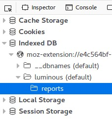
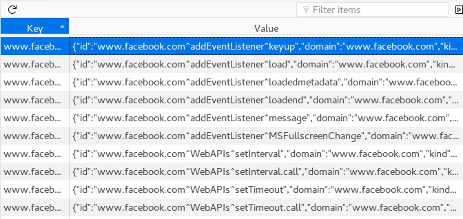
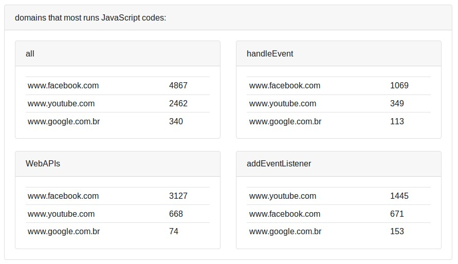
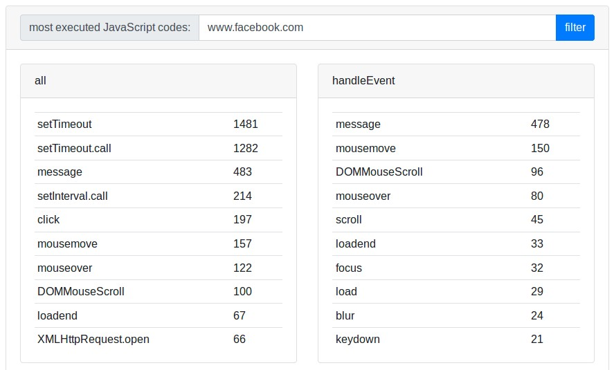

> *If you find some missing information or errors in any of the translations, help us by opening a [pull request](https://github.com/gbaptista/luminous/pulls) with the necessary modifications in the texts.*

# Guides
> [back to index](../)

## Reports
> en-US | [es](../../../es/guides/how-it-works/reports.md) | [pt-BR](../../../pt-BR/guides/how-it-works/reports.md)

Reports provide insights into all JavaScript executions detected in your browser.

### How is the data collected and stored?

The [`js/background/reports.js`](https://github.com/gbaptista/luminous/blob/master/js/background/reports.js) file looks for information about the open tabs in [*storage.local*](https://developer.mozilla.org/pt-BR/Add-ons/WebExtensions/API/storage/local) and the with the [*Dexie.js*](http://dexie.org/) library generates the data that is stored in [*IndexedDB*](https://developer.mozilla.org/pt-BR/docs/Web/API/IndexedDB_API).

The data structure used:

```json
{
  "id": "www.google.com^handleEvent^mouseover",
  "domain": "www.google.com",
  "kind": "handleEvent",
  "code": "mouseover",
  "allowed": 6,
  "blocked": 3,
  "calls": 9
}
```

You can see the data stored in your browser:

> 

> 

> 

### Available views

#### Domains that most runs JavaScript codes:



#### Most executed JavaScript codes:


#### Filter by domain


