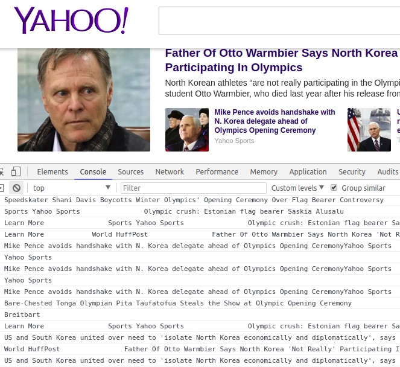
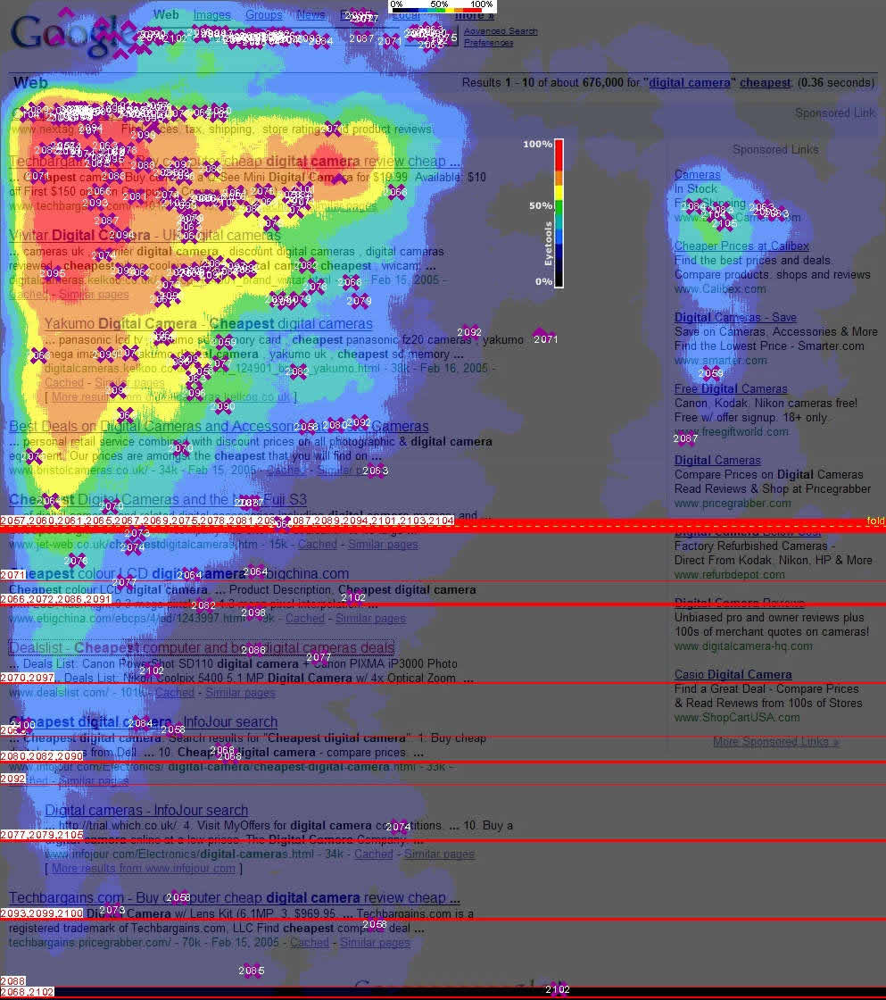

> *If you find some missing information or errors in any of the translations, help us by opening a [pull request](https://github.com/gbaptista/luminous/pulls) with the necessary modifications in the texts.*

# Guides
> [back to index](../)

## mousemove
> en-US | [es](../../../es/guides/javascript/mousemove.md) | [pt-BR](../../../pt-BR/guides/javascript/mousemove.md)

The [`mousemove`](https://developer.mozilla.org/en-US/docs/Web/Events/mousemove) event is fired each time your mouse pointer moves over something.

The mouse is interpreted as your eyes from the websites point of view. It can be used to identify what you are reading. With [*jQuery*](https://jquery.com/) and a few lines of *JavaScript* the following code could be created:

```javascript
$(document).ready(function() {
  var last_text = undefined;

  $('*').on('mousemove', function(event) {
    var current_text = $(event.target).text().replace(/(\r\n|\n|\r)/gm, '').slice(0, 100);

    if(current_text && current_text != last_text) {
      last_text = current_text;

      console.log(last_text);
    }
  });
});
```

With it what you are reading can be seen through the movement of your mouse:



See the full example [here](https://gist.github.com/gbaptista/b5af05e273db9d16b2fb2636e2e0d39f).

Another use is to know "where are you looking" with the creation of heat maps:



It should also be noted that mousemove is only one of many similar JavaScript events that detect mouse movement. Other similar events include but are not limited to `DOMMouseMove`, `pointermove`, and `touchmove` as well as the camelcase versions of these terms, such as `mouseMove`, `pointerMove` and `touchMove`.

See also: [the `scroll` JavaScript event](./scroll.md).

