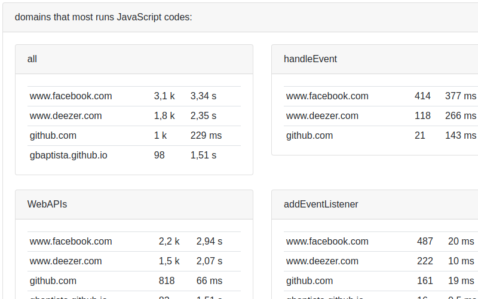
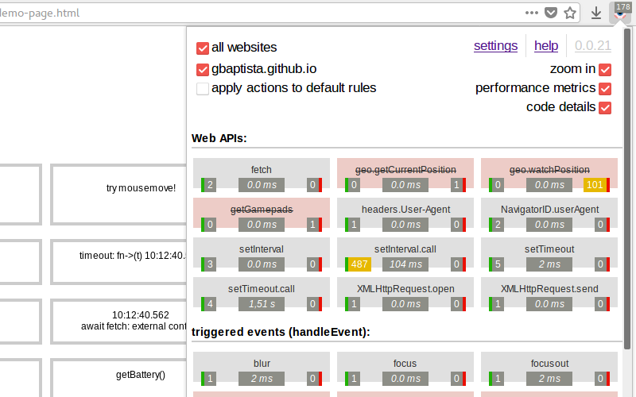
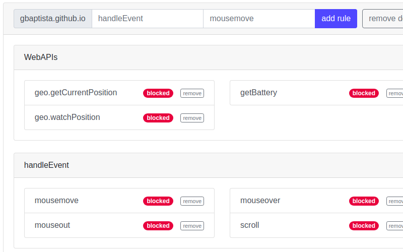

> *If you find some missing information or errors in any of the translations, help us by opening a [pull request](https://github.com/gbaptista/luminous/pulls) with the necessary modifications in the texts.*

# Guides
> [back to index](../guides)

## Screenshots
> en-US | [es](../../../doc/es/guides/screenshots.md) | [pt-BR](../../../doc/pt-BR/guides/screenshots.md)

##### Popup

##### Reports

##### Settings

##### Popup

##### Reports

##### Settings

