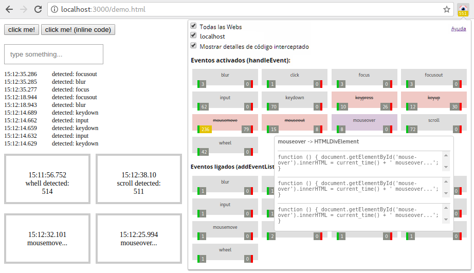

# Luminous: Bloqueador de eventos JavaScript 

> [en-US](../en-US) | es | [pt-BR](https://gbaptista.github.io/luminous)

Una extensión experimental para identificar, analizar y bloquear la ejecución de código y la recopilación de eventos a través de *JavaScript* en su navegador.

- [¿Por qué?](#por-qu%C3%A9)
- [Comprender la interfaz de usuario](#comprender-la-ui)
- [Cómo instalar](#c%C3%B3mo-instalar)
- [¡Pruébalo!](#pru%C3%A9balo)
- [Capturas de pantalla](#capturas-de-pantalla)
- [Profundizando](#profundizando)
- [Guías](#guías)
- [Cómo contribuir](#c%C3%B3mo-contribuir)
- [Problemas conocidos](#problemas-conocidos)
- [Entender el código](#comprender-el-c%C3%B3digo)
- [Licencia](#licencia)
- [Donaciones](#donaciones)

## ¿Por qué?

Tenemos proyectos increíbles como [*Lightbeam*](https://www.mozilla.org/es-ES/lightbeam/), [*NoScript*](https://noscript.net/), [*ScriptSafe*](https://github.com/andryou/scriptsafe), [*uBlock Origin*](https://github.com/gorhill/uBlock), [*HTTPS Everywhere*](https://github.com/EFForg/https-everywhere) y muchos otros. Todos tienen la propuesta de identificar y / o prevenir la ejecución de códigos y solicitudes cuestionables.


Estas herramientas son vitales, pero inevitablemente debemos hacer concesiones para acceder a muchos sitios web ya que tenemos un uso masivo de *JavaScript* en la web. Cuando accedes, por ejemplo, al sitio web [*Google Translate*](https://translate.google.com), con un combo de 3 extensiones (*HTTPS Everywhere*, *uBlock Origin* y *ScriptSafe*) y *Luminous*, tenemos el siguiente resultado después de unos momentos:

> 

- **6** solicitudes influenciadas por *HTTPS en todas partes*
- **75** solicitudes bloqueadas por *uBlock Origin*
- **4** elementos bloqueados por *ScriptSafe*
- **7,6 mil** *JavaScript* ejecuciones detectadas por *Luminous*

Es sobre este número (**7,6 mil**) que estamos perdidos y con las manos atadas, es que no sabemos qué pasa y aún no tenemos la libertad de decidir qué se puede o no se puede ejecutar . Este es el objetivo principal del proyecto, llenar este vacío y poder ver y controlar lo que sucede. Como efecto secundario, también tenemos una herramienta interesante que ayuda en el proceso de desarrollo del código *JavaScript* al darnos visibilidad sobre lo que está sucediendo.

## Comprender la UI


## Cómo instalar

- Chromium y Google Chrome: [Chrome Web Store](https://chrome.google.com/webstore/detail/luminous-javascript-event/baacpbikplogpeecclpnajnlghmcldkb)
- Mozilla Firefox: [Fifrefox Add-ons](https://addons.mozilla.org/es/firefox/addon/luminous/)
- Opera: [Complementos de Opera](https://addons.opera.com/es/extensions/details/luminous-javascript-events-blocker/)

## ¡Pruébalo!

[Instalar](#c%C3%B3mo-instalar) la extensión e ir a nuestra [página de demostración](https://gbaptista.github.io/luminous/html/demos/detections/index.html) para experimentar y comprender mejor cómo funciona:



## Capturas de pantalla

Ver algunas capturas de pantalla [aquí](./guides/screenshots.md).

## Profundizando

- Documental: [*Do Not Track*](https://donottrack-doc.com)
- Libro: [*1984*](https://www.amazon.com.br/1984-George-Orwell-ebook/dp/B00BFGQYRQ)
- Libro: [*Cypherpunks: La libertad y el futuro de Internet*](https://www.amazon.com/Cypherpunks-Freedom-Internet-Julian-Assange-ebook/dp/B00AZBI4IO)
- Libro: [*El filtro burbuja: Cómo la web decide lo que leemos y lo que pensamos*](https://www.amazon.com.br/El-filtro-burbuja-decide-pensamos-ebook/dp/B01N6VIJ4S)
- Página web: [*La trampa de JavaScript*](https://www.gnu.org/philosophy/javascript-trap.es.html)
- Página web: [*Integridad de Internet*](https://www.mozilla.org/es-ES/internet-health/)
- Página web: [*Acerca de Lightbeam*](https://www.mozilla.org/es-ES/lightbeam/about/)

## Guías

Las Guías son documentos sobre temas muy específicos donde podemos ir profundamente en los detalles y encontrar fácilmente la información que estamos buscando. Ver [todas las guías](./guides/).

## Cómo contribuir

  - [Corre la voz](#difundir-la-palabra)
    - [Escriba alguna guía](#escriba-alguna-guía)
    - [Comparte](#compartir)
    - [Escribir y hablar sobre ello](#escribir-y-hablar-sobre-ello)
    - [Ayuda con traducciones](#ayuda-con-traducciones)
  - [Informar problemas](#informar-problemas)
    - [Problemas en sitios específicos](#problemas-en-sitios-espec%C3%ADficos)
    - [Problemas en algunos navegadores](#problemas-en-algunos-navegadores)
  - [Ensuciate las manos](#ensuciate-las-manos)
    - [Mejorar la UI](#mejora-la-ui)
    - [Mejorar el rendimiento](#mejorar-el-rendimiento)
    - [Crear nuevas características](#crear-nuevas-caracter%C3%ADsticas)
    - [Mejorar la calidad del código](#mejora-la-calidad-del-c%C3%B3digo)

### Difundir la palabra

#### Escriba alguna guía

Colabora escribiendo una [guía](#guías) sobre temas relacionados con el proyecto.

#### Compartir

¡Cuénteles a sus amigos, familiares y compañeros de trabajo cómo se usó la extensión para mejorar su experiencia web y enséñeles a usarla también!

#### Escribir y hablar sobre ello

¿Encontraste un sitio web invadiendo tu privacidad? ¿Bloqueaste eventos que no querías? ¿Le hizo más fácil desarrollar su código o corregir errores? Grabe un video, prepare una charla, escriba un artículo o algo así para contar cómo se hizo, explicando cómo le ayudó la extensión y mostrando las posibilidades.

#### Ayuda con traducciones

Traduzca los archivos `.md` que se encuentran dentro del directorio `doc/` y los archivos `.json` en el directorio `_locales/` de su idioma y ¡ayúdenos a llegar a más personas!

### Informar problemas

#### Problemas en sitios específicos

¿Tuvo problemas para acceder a un sitio debido a la extensión? ¿Fue lento? ¿Causado errores? ¿El sitio ha dejado de funcionar? No todos los eventos fueron identificados? Abra un [*issue*](https://github.com/gbaptista/luminous/issues) y díganos qué sucedió.

#### Problemas en algunos navegadores

Abra un [*issue*](https://github.com/gbaptista/luminous/issues) si algo no funcionó como se esperaba en un navegador. ¡Queremos que todo funcione bien para todos los navegadores posibles!

### Ensuciate las manos

#### Mejora la UI

No tenemos la interfaz más bella y amigable del mundo. [Discusiones](https://github.com/gbaptista/luminous/issues) y [propuestas](https://github.com/gbaptista/luminous/pulls) en una nueva interfaz o mejoras a la existente (*`html/interface-sample.html`*) será muy bienvenido! No subestime el poder de este tipo de colaboración: [better_errors#6](https://github.com/charliesome/better_errors/issues/6) - [better_errors#22](https://github.com/charliesome/better_errors/pull/22)

#### Mejorar el rendimiento

**Ejemplo 1**: Cuanto antes podamos inyectar código en los sitios web y cuantos menos recursos usemos para procesar la información, más ejecuciones podremos identificar y mejor será nuestra experiencia al tener una extensión que no disminuya la velocidad de navegación.

Busque, por ejemplo, nuestra página de demostración (*`html/demos/detections/index.html`*):

```javascript
(function() { setTimeout(function() {
  // JavaScript code...
}, 100); })();
```

Esta demora de 100 milisegundos existe porque sin ella el código se ejecuta demasiado rápido y no podemos interceptarlo. ¿Cómo podemos mejorar esto para no necesitar este retraso o poder reducirlo?

**Ejemplo 2**: capturamos solo una parte de la función interceptada, porque puede ser muy grande y dejar que la lectura de la información sea lenta (*`js/content/interceptor.js`*):

```javascript
listener: ('' + listener).slice(0, 400)
```

¿Cómo podemos mejorar esto? ¿Es esta la mejor manera de lidiar con este problema?

**Ejemplo 3**: La forma en que encontramos pasar mensajes del contexto del documento al contexto de la extensión fue mediante el análisis de los datos en *JSON* leyendo un elemento *HTML* (*`js/content/readers/data.js`*):

```javascript
render_data(
  JSON.parse($(data_element).html()),
  tab_id
);
```

¿Hay alternativas? ¿Analizar la información constantemente es la mejor opción?

#### Crear nuevas características

Comenzamos con una idea básica: identificar y bloquear eventos. Podemos ampliar esta idea, algunos pensamientos que ya han surgido:

- Solo interceptamos llamadas a `addEventListener` y` handleEvent`. ¿No sería interesante también interceptar llamadas a `XMLHttpRequest` y otras?


- No estamos interceptando *eventos definidos* en línea (`<a onclick="someAction()">`), ¿no sería interesante hacerlo?


- Hoy podemos bloquear eventos por dominio: *"Bloquear la ejecución de mouseover en el dominio somesite.com"*. ¿No sería interesante tener reglas más elaboradas y bloquear un evento solo si su objetivo es un elemento de tipo X o si el código ejecutado coincide con alguna expresión regular?

#### Mejora la calidad del código

Este es un proyecto experimental que creció de manera incontrolada, no tenemos un estándar definido de nomenclatura, una organización sólida basada en algún *patrón de diseño* o pruebas automatizadas. ¡Las discusiones para mejorar la calidad del código serán bienvenidas!

## Problemas conocidos

- [Sin soluciones](#sin-soluciones)
- [Con soluciones](#con-soluciones)
  - [Mozilla Firefox Service Workers](#mozilla-firefox-service-workers)

### Sin soluciones

 - No hemos interceptado *códigos* en línea (`<a onclick="someAction()">`).


 - Se puede ejecutar un código antes de que podamos inyectar el interceptor. Es raro, pero posible.


 - Algunos sitios con una cantidad absurda de eventos *JavaScript* pueden ralentizar la experiencia de navegación debido a la recopilación de datos en los códigos interceptados.

### Con soluciones

#### Mozilla Firefox Service Workers

En *Mozilla Firefox* y derivados, algunos sitios web que usan [*Service Workers*](https://developer.mozilla.org/en-US/docs/Web/API/Service_Worker_API) (como [*WhatsApp Web*](https://web.whatsapp.com/)) pueden bloquear la interceptación del código debido a un error en la interceptación de las cabeceras con las pautas de [*Content-Security-Policy*](https://developer.mozilla.org/en-US/docs/Web/HTTP/Headers/Content-Security-Policy). La solución actual es volver a cargar el *Service Worker*:

 - Acceda a la pantalla *Service Workers* en: `about:debugging#workers`
 - Haga clic en *unregister* en el *Service Worker* del sitio web deseado:
  
 - Recargar el sitio web.

## Comprender el código

- [Fondo](#fondo)
- [Contenido](#contenido)
- [Ventana emergente](#ventana-emergente)
- [Ajustes](#ajustes)
- [Utiles](#utiles)
- [Bibliotecas de terceros](#bibliotecas-de-terceros)

### Fondo

`js/background`:

- `js/background/set_current_tab.js`: responsable de inyectar la *pestaña* *ID* actual en el documento.

- `js/background/update_badge.js`: Responsable de actualizar el contador en el ícono de la extensión.

### Contenido

`/content/injections`:

 - `/content/injections/data.js`: responsable de inyectar el elemento *HTML* que almacenará los datos recopilados de las intercepciones.

 - `/content/injections/interceptor.js`: responsable de inyectar el código que realmente ejecutará las intercepciones en el documento.

- `/content/injections/options.js`: responsable de inyectar el elemento *HTML* que almacenará las opciones definidas por el usuario.


`/content/readers`:

- `/content/readers/data.js`: responsable de leer los datos en el elemento *HTML* del documento que almacena los detalles recopilados de las intercepciones y los pasa a la extensión.

`/content/injections_controller.js`: Responsable de tomar decisiones sobre las inyecciones de código.

`/content/interceptor.js`: responsable de interceptar ejecuciones de códigos *JavaScript* en el contexto del documento y recopilar detalles sobre ellos.

### Ventana Emergente

Responsable de procesar y cuidar las interacciones realizadas en la ventana emergente que se abre al hacer clic en el ícono de la extensión:

- `html/popup/popup.html`
- `html/popup/templates/counters.html`
- `html/popup/templates/options.html`
- `js/popup/popup.js`
- `css/popup/popup.css`

### Ajustes

Responsable de renderizar y manejar las interacciones en las páginas de ajustes:

- `html/settings/*.html`
- `js/settings/*.js`
- `css/settings/*.css`

### Utiles

- `js/utils/colors.js`: Función utilizada para determinar el color mostrado en función del valor del contador.
- `js/utils/number.js`: Función utilizada para formatear el número según su tamaño.

### Bibliotecas de terceros

- `vendor/bootstrap`: [*Bootstrap: biblioteca de componente front-end*](https://github.com/twbs/bootstrap)
- `vendor/jquery`: [*jQuery JavaScript Library*](https://github.com/jquery/jquery)
- `vendor/mustachejs`: [*Plantilla mínima con {{bigotes}} en JavaScript*](https://github.com/janl/mustache.js)
- `vendor/tippyjs`: [*Una biblioteca ligera, vainilla JS tooltip*](https://github.com/atomiks/tippyjs)

## Licencia

Este proyecto está licenciado bajo la licencia [*GPLv3*](LICENSE).

## Donaciones

No hay ningún tipo de organización para recibir donaciones en este momento. Consulte nuestra guía sobre "[cómo contribuir](#c%C3%B3mo-contribuir)" a otras formas de contribuir. Si realmente quieres hacer una donación, aquí hay algunos fundamentos increíbles que comparten algunos ideales de este proyecto que puedes ayudar:

- [*Electronic Frontier Foundation*](https://supporters.eff.org/donate)
- [*Free Software Foundation*](https://www.fsf.org/about/ways-to-donate)
- [*Fundación Mozilla*](https://donate.mozilla.org)
- [*Tor Project*](https://donate.torproject.org)
