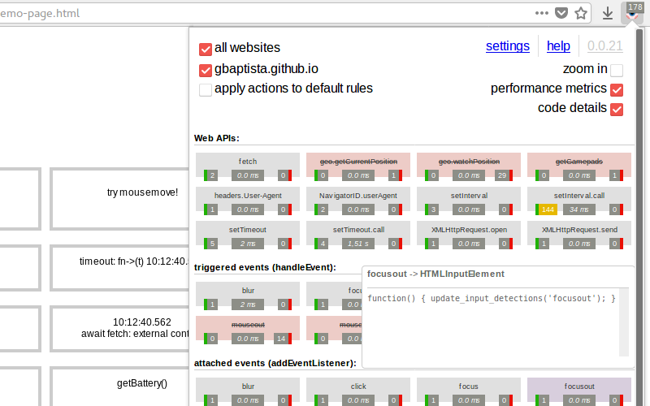
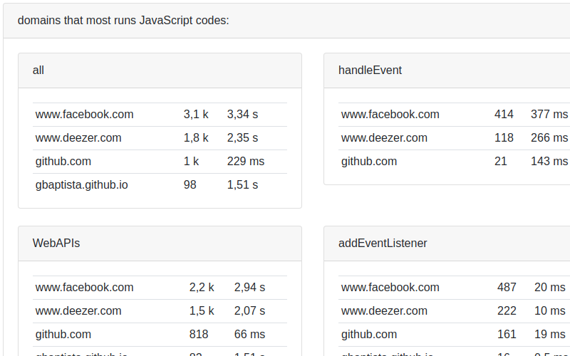
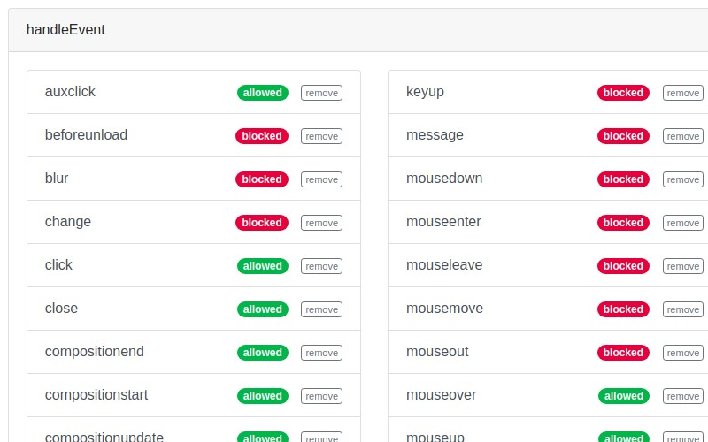
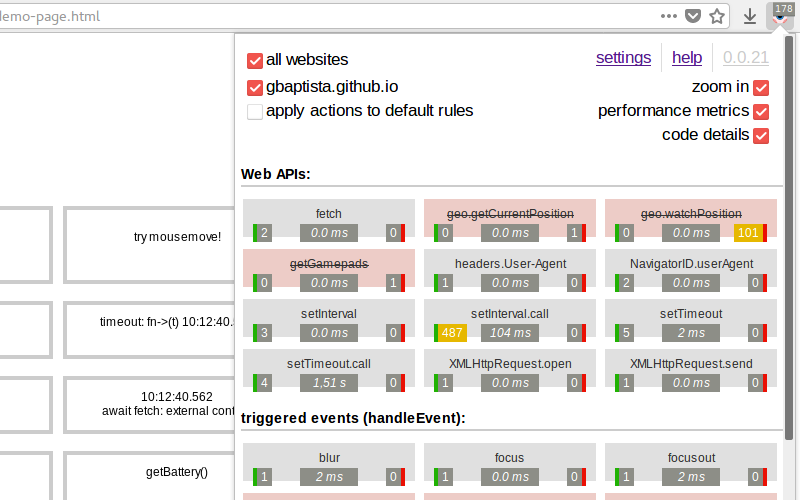
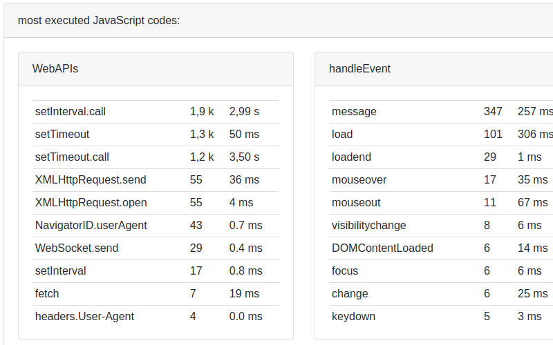
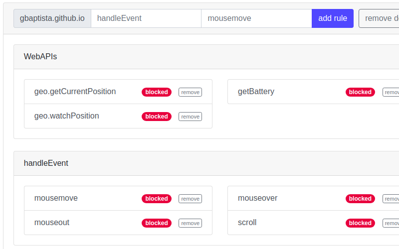

> *Si encuentra información que falta o errores en alguna de las traducciones, nos ayude abriendo un [pull request](https://github.com/gbaptista/luminous/pulls) con las modificaciones necesarias en los textos para que todos tengan acceso a las guías en su idioma.*

# Guías
> [volver al índice](../guides)

## Capturas de pantalla
> [en-US](../../../doc/en-US/guides/screenshots.md) | es | [pt-BR](../../../doc/pt-BR/guides/screenshots.md)

##### Ventana emergente

##### Informes

##### Ajustes

##### Ventana emergente

##### Informes

##### Ajustes

