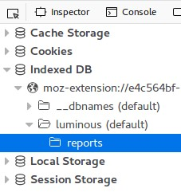
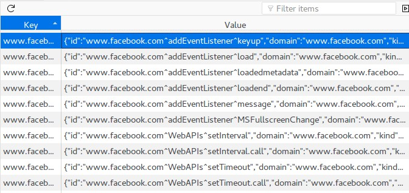
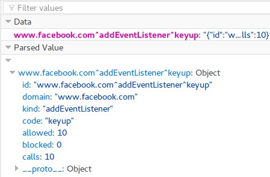
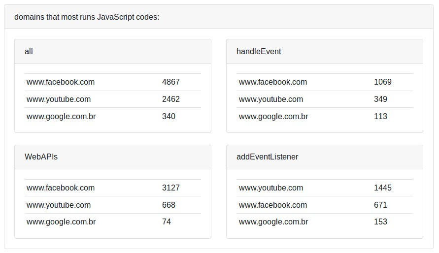
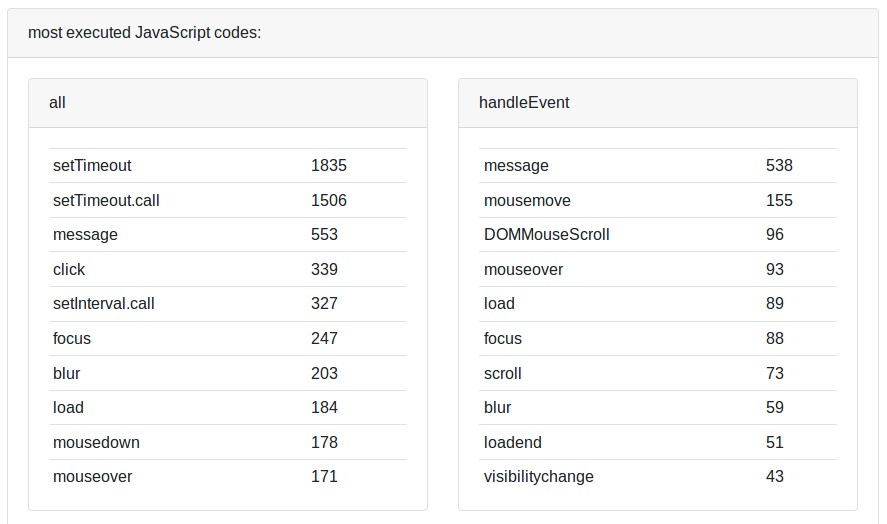
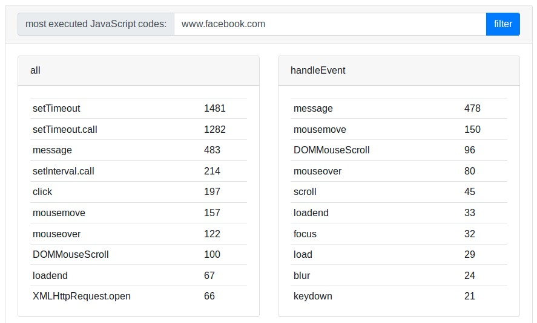

> *Se você encontrar informações faltando ou erros em alguma das traduções, nos ajude abrindo um [pull request](https://github.com/gbaptista/luminous/pulls) com as modificações necessárias nos textos para que todos tenham acesso aos guias em seu idioma.*

# Guias
> [voltar ao índice](../)

## Relatórios
> [en-US](../../../en-US/guides/how-it-works/reports.md) | [es](../../../es/guides/how-it-works/reports.md) | pt-BR

Os relatórios oferecem uma visão sobre todas as execuções de JavaScript detectadas no seu navegador.

### Como os dados são coletados e armazenados?

O arquivo [`js/background/reports.js`](https://github.com/gbaptista/luminous/blob/master/js/background/reports.js) busca informações sobre as abas abertas no [*storage.local*](https://developer.mozilla.org/pt-BR/Add-ons/WebExtensions/API/storage/local) e a partir da biblioteca [*Dexie.js*](http://dexie.org/) gera os dados que são armazenados no [*IndexedDB*](https://developer.mozilla.org/pt-BR/docs/Web/API/IndexedDB_API).

A estrutura de dados utilizada é a seguinte:

```json
{
  "id": "www.google.com^handleEvent^mouseover",
  "domain": "www.google.com",
  "kind": "handleEvent",
  "code": "mouseover",
  "allowed": 6,
  "blocked": 3,
  "calls": 9
}
```

Você pode ver os dados armazenados no seu navegador:

> 

> 

> 

### Visualizações disponíveis

#### Domínios que mais executam códigos JavaScript:



#### Códigos JavaScript mais executados:



#### Filtro por site


