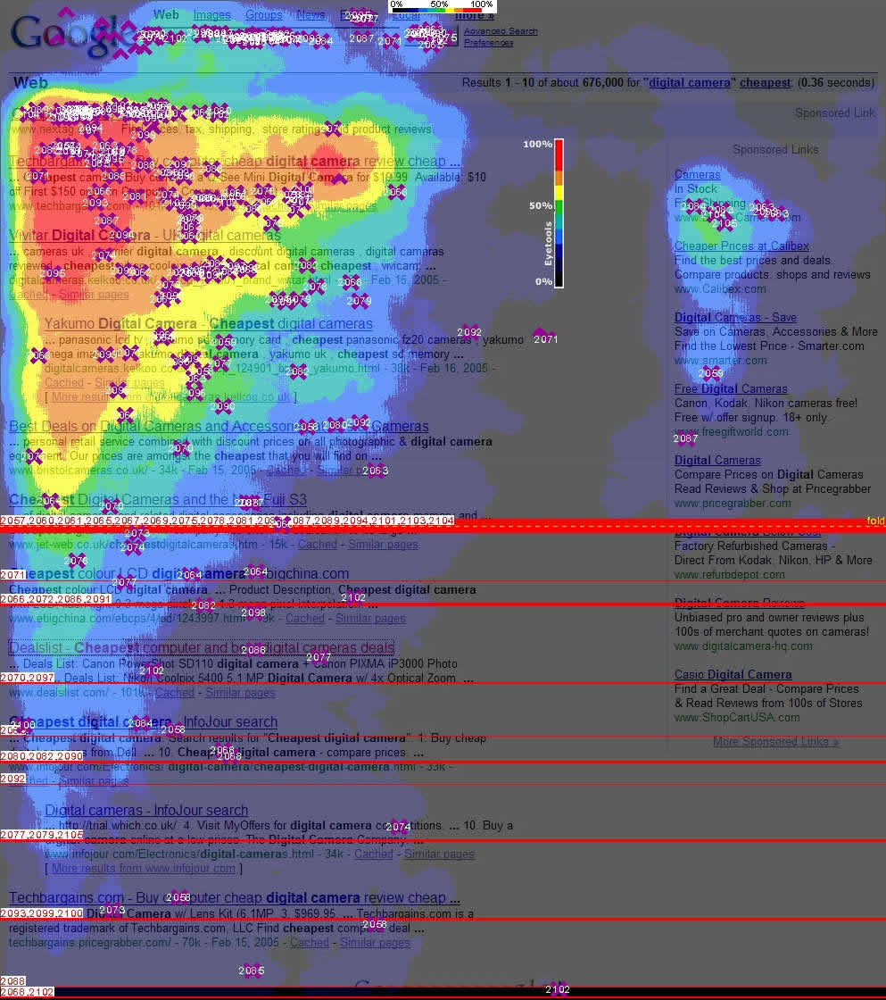

> *Se você encontrar informações faltando ou erros em alguma das traduções, nos ajude abrindo um [pull request](https://github.com/gbaptista/luminous/pulls) com as modificações necessárias nos textos para que todos tenham acesso aos guias em seu idioma.*

# Guias
> [volta ao índice](../)

## mousemove
> [en-US](../../../en-US/guides/javascript/mousemove.md) | [es](../../../es/guides/javascript/mousemove.md) | pt-BR

O evento [`mousemove`](https://developer.mozilla.org/en-US/docs/Web/Events/mousemove) é disparado toda vez que o ponteiro do seu mouse é movimentado sobre algum elemento.

O mouse é interpretado como os seus olhos do ponto de vista dos sites. Ele pode ser utilizado para identificar o que você está lendo. Com [*jQuery*](https://jquery.com/) e poucas linhas de *JavaScript* o seguinte código poderia ser criado:

```javascript
$(document).ready(function() {
  var last_text = undefined;

  $('*').on('mousemove', function(event) {
    var current_text = $(event.target).text().replace(/(\r\n|\n|\r)/gm, '').slice(0, 100);

    if(current_text && current_text != last_text) {
      last_text = current_text;

      console.log(last_text);
    }
  });
});
```

Com ele o que você está lendo pode ser visto através do movimento do seu mouse:


Veja o exemplo completo [aqui](https://gist.github.com/gbaptista/b5af05e273db9d16b2fb2636e2e0d39f).

Outra aplicação é a saber "onde você está olhando" com a criação de mapas de calor:


