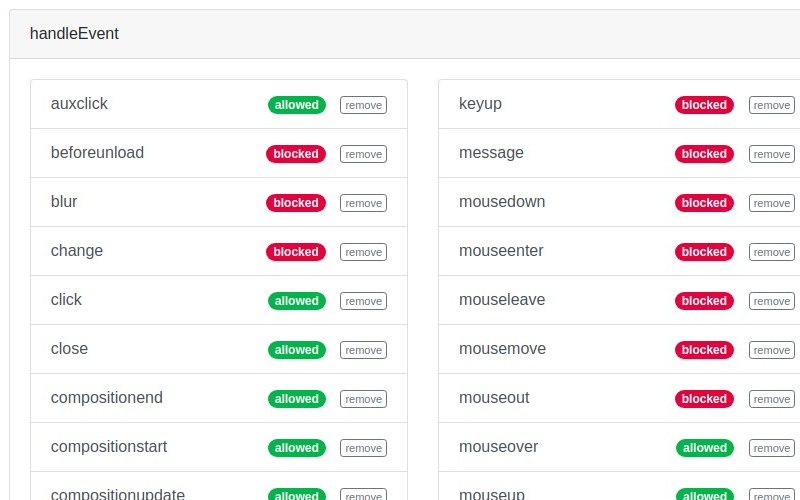
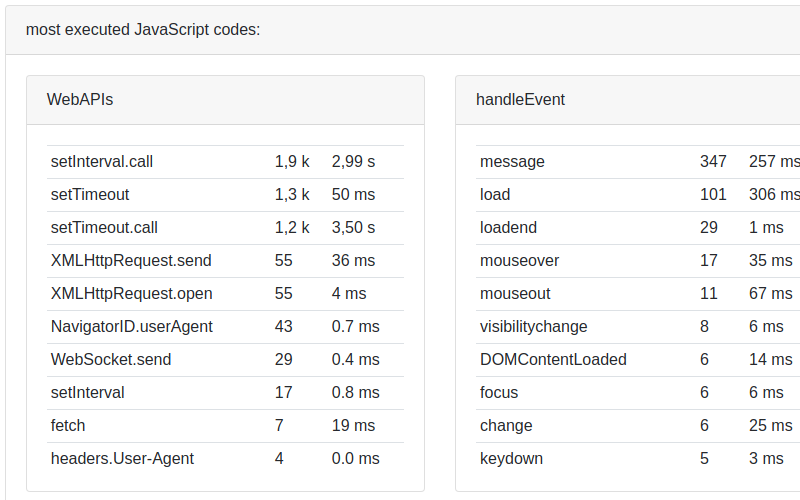

> *Se você encontrar informações faltando ou erros em alguma das traduções, nos ajude abrindo um [pull request](https://github.com/gbaptista/luminous/pulls) com as modificações necessárias nos textos para que todos tenham acesso aos guias em seu idioma.*

# Guias
> [voltar ao índice](../guides)

## Capturas de tela
> [en-US](../../../doc/en-US/guides/screenshots.md) | [es](../../../doc/es/guides/screenshots.md) | pt-BR

##### Popup

##### Relatórios

##### Configurações

##### Popup

##### Relatórios

##### Configurações

